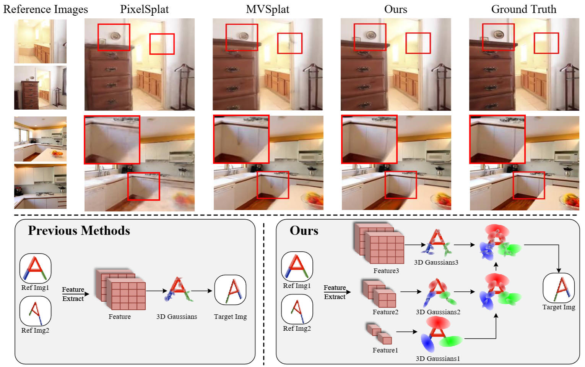

# HiSplat

The official implementation of **HiSplat: Hierarchical 3D Gaussian Splatting for Generalizable Sparse-View Reconstruction**

Authors: [Shengji Tang](https://scholar.google.com/citations?user=K7drMDgAAAAJ&hl=en&oi=ao), [Weicai Ye](https://ywcmaike.github.io/), [Peng Ye](https://scholar.google.com/citations?user=UEZZP5QAAAAJ&hl=en), [Weihao Lin](https://scholar.google.com/citations?user=k5MQpaIAAAAJ&hl=en), [Yang Zhou](https://github.com/yangzhou24), [Tao Chen](https://scholar.google.com/citations?user=w3OoFL0AAAAJ&hl=en) and [Wanli Ouyang](https://wlouyang.github.io/).

### [Project Page](https://open3dvlab.github.io/HiSplat/) | [Paper](https://arxiv.org/pdf/2410.06245)
## 📰 News
2025-01-22 🏆HiSplat is accepted by ICLR 2025!

2025-01-03 🌟Add checkpoint of dataset ACID in [Google Drive](https://drive.google.com/drive/folders/1U6GGbvk-oCMq-HTXxuIJf1q7PaRKiWdB?usp=sharing) and [Baidu Cloud](https://pan.baidu.com/s/1QpffUcBW-G8yvqwAHF5vLg?pwd=9h4j).

2024-12-06 🌟Add the implementation for zero-shot testing on DTU and Replica in the 3-view setting.
## 📓 Abstract
Reconstructing 3D scenes from multiple viewpoints is a fundamental task in stereo vision. Recently, advances in generalizable 3D Gaussian Splatting have enabled high-quality novel view synthesis for unseen scenes from sparse input views by feed-forward predicting per-pixel Gaussian parameters without extra optimization. However, existing methods typically generate single-scale 3D Gaussians, which lack representation of both large-scale structure and texture details, resulting in mislocation and artefacts. In this paper, we propose a novel framework, HiSplat, which introduces a hierarchical manner in generalizable 3D Gaussian Splatting to construct hierarchical 3D Gaussians via a coarse-to-fine strategy. Specifically, HiSplat generates large coarse-grained Gaussians to capture largescale structures, followed by fine-grained Gaussians to enhance delicate texture details. To promote inter-scale interactions, we propose an Error Aware Module for Gaussian compensation and a Modulating Fusion Module for Gaussian repair. Our method achieves joint optimization of hierarchical representations, allowing for novel view synthesis using only two-view reference images. Comprehensive experiments on various datasets demonstrate that HiSplat significantly enhances reconstruction quality and cross-dataset generalization compared to prior singlescale methods. The corresponding ablation study and analysis of different-scale 3D Gaussians reveal the mechanism behind the effectiveness.

## 🚩 Open-source Plan
> ✅ Release basic code and checkpoints.  
> 🔲  Release all checkpoints and more useful scripts.   
> 🔲  Scripts for processing other datasets and private data. 

## 🏡Installation

To get started, you need to   
> 1.Create an environment of HiSplat(**Necessary**)  
> 2.Prepare the corresponding dataset(**For training and testing; We also provide a tiny demo detaset from DTU and RealEstate10K**)   
> 3.Download the checkpoints(**For training, download pretrained checkpoint of DinoV2 and Unimatch; For testing, download our checkpoint**)

### Prepare Environment
It is recommended to use Anaconda to create a virtual environment.  
```bash
# create and initialize the virtual environment
conda create -n hisplat python=3.10
conda activate hisplat
# install pytorch
pip install torch==2.1.2 torchvision==0.16.2 torchaudio==2.1.2 --index-url https://download.pytorch.org/whl/cu118
# install other requirements
pip install -r requirements.txt
```
### Prepare Dataset
#### RealEstate10K, ACID and DTU
For RealEstate10K and ACID, we use the same datasets as [MVSPlat](https://github.com/donydchen/mvsplat) 
and [PixelSplat](https://github.com/dcharatan/pixelsplat). Below we quote the dataset preparation of them.
> pixelSplat was trained using versions of the RealEstate10k and ACID datasets that were split into ~100 MB chunks for use on server cluster file systems. Small subsets of the Real Estate 10k and ACID datasets in this format can be found [here](https://drive.google.com/drive/folders/1joiezNCyQK2BvWMnfwHJpm2V77c7iYGe?usp=sharing). To use them, simply unzip them into a newly created `datasets` folder in the project root directory.

> If you would like to convert downloaded versions of the Real Estate 10k and ACID datasets to our format, you can use the [scripts here](https://github.com/dcharatan/real_estate_10k_tools). Reach out to us (pixelSplat) if you want the full versions of our processed datasets, which are about 500 GB and 160 GB for Real Estate 10k and ACID respectively.

> * Download the preprocessed DTU data [dtu_training.rar](https://drive.google.com/file/d/1eDjh-_bxKKnEuz5h-HXS7EDJn59clx6V/view).
> * Convert DTU to chunks by running `python src/scripts/convert_dtu.py --input_dir PATH_TO_DTU --output_dir datasets/dtu`
> * [Optional] Generate the evaluation index by running `python src/scripts/generate_dtu_evaluation_index.py --n_contexts=N`, where N is the number of context views. (For N=2 and N=3, we have already provided our tested version under `/assets`.)

#### Replica
For Replica, we follow [Semantic-NeRF](https://github.com/Harry-Zhi/semantic_nerf) and use the provided pre-rendered Replica dataset. You can follow the scripts as below

> * Download the pre-rendered [Replica dataset](https://www.dropbox.com/sh/9yu1elddll00sdl/AAC-rSJdLX0C6HhKXGKMOIija?dl=0) and unzip them. We only need the pictures and camera poses in office 0-4 and room 0-2. 
> * Convert Replica to chunks by running `python src/scripts/convert_replica.py --input_dir PATH_TO_REPLICA --output_dir datasets/replica`

### Download Checkpoint
Besides the offical link, we also provide link of [Google Drive](https://drive.google.com/drive/folders/1U6GGbvk-oCMq-HTXxuIJf1q7PaRKiWdB?usp=sharing) and [Baidu Cloud](https://pan.baidu.com/s/1QpffUcBW-G8yvqwAHF5vLg?pwd=9h4j) for all checkpoints. 
Because HiSplat checkpoints includes the stat dict of optimizer, the checkpoints are about 1.04GB.  
```bash
# download the pretrained weight of unimatch from official link
wget 'https://s3.eu-central-1.amazonaws.com/avg-projects/unimatch/pretrained/gmdepth-scale1-resumeflowthings-scannet-5d9d7964.pth'
mv gmdepth-scale1-resumeflowthings-scannet-5d9d7964.pth ./checkpoints
# download the pretrained weight of DinoV2[DINOv2-B]
wget 'https://dl.fbaipublicfiles.com/dinov2/dinov2_vitb14/dinov2_vitb14_pretrain.pth'
mv dinov2_vitb14_pretrain.pth ./checkpoints
# download our pretrained checkpoints and move it to ./checkpoints
mv hisplat_re10k.ckpt ./checkpoints
```

## 🏃 Running
### ⚡ Quick Start
To validate the environment and show the performance, just run the following:
```bash
python demo.py +experiment=re10k mode=test output_dir=temp checkpointing.load=./checkpoints/hisplat_re10k.ckpt
```
It will output a video from two context images in demo/output. 


### ❄️Testing

To render novel views and compute evaluation metrics from a pretrained model,

* get the [pretrained models](https://drive.google.com/drive/folders/1U6GGbvk-oCMq-HTXxuIJf1q7PaRKiWdB?usp=sharing), and save them to `./checkpoints`

* run the following:

```bash
# Testing on RealEstate10K (input 2 views)
python -m src.main +experiment=re10k checkpointing.load=./hisplat_re10k.ckpt mode=test dataset/view_sampler=evaluation dataset.view_sampler.index_path=assets/evaluation_index_re10k.json test.compute_scores=true output_dir=test_re10k
# Testing on ACID (input 2 views)
python -m src.main +experiment=acid checkpointing.load=./hisplat_acid.ckpt mode=test dataset/view_sampler=evaluation dataset.view_sampler.index_path=assets/evaluation_index_acid.json test.compute_scores=true output_dir=test_acid
# Cross-dataset testing RealEstate10K -> DTU (input 2 or 3 views)
python -m src.main +experiment=dtu checkpointing.load=./hisplat_re10k.ckpt mode=test dataset/view_sampler=evaluation dataset.view_sampler.index_path=assets/evaluation_index_dtu_nctx2.json test.compute_scores=true output_dir=test_dtu
python -m src.main +experiment=dtu checkpointing.load=./hisplat_re10k.ckpt mode=test dataset/view_sampler=evaluation dataset.view_sampler.index_path=assets/evaluation_index_dtu_nctx3.json test.compute_scores=true output_dir=test_dtu dataset.view_sampler.num_context_views=3
# Cross-dataset testing RealEstate10K -> ACID (input 2 views)
python -m src.main +experiment=acid checkpointing.load=./hisplat_re10k.ckpt mode=test dataset/view_sampler=evaluation dataset.view_sampler.index_path=assets/evaluation_index_acid.json test.compute_scores=true output_dir=test_acid
# Cross-dataset testing RealEstate10K -> Replica (input 2 or 3 views)
python -m src.main +experiment=replica checkpointing.load=./hisplat_re10k.ckpt mode=test dataset/view_sampler=evaluation dataset.view_sampler.index_path=assets/evaluation_index_replica_nctx2.json test.compute_scores=true output_dir=test_replica
python -m src.main +experiment=replica checkpointing.load=./hisplat_re10k.ckpt mode=test dataset/view_sampler=evaluation dataset.view_sampler.index_path=assets/evaluation_index_replica_nctx3.json test.compute_scores=true output_dir=test_replica dataset.view_sampler.num_context_views=3
```

### 🔥 Training

Run the following:

```bash
# Train on RealEstate10K
python -m src.main +experiment=re10k data_loader.train.batch_size=2 device=auto output_dir=EXP_SAVING_PATH trainer.val_check_interval=3000
# Train on ACID
python -m src.main +experiment=acid data_loader.train.batch_size=2 device=auto output_dir=EXP_SAVING_PATH trainer.val_check_interval=3000
```
Our model is trained on 8 RTX4090. The training batch size of each card is 2 and the total batch size is 16. The peak training GPU memory is about 19.7GB. You can use less or more GPUs depending on the GPU memory. 


## BibTeX

```bibtex
@article{tang2024hisplat,
  title={HiSplat: Hierarchical 3D Gaussian Splatting for Generalizable Sparse-View Reconstruction},
  author={Tang, Shengji and Ye, Weicai and Ye, Peng and Lin, Weihao and Zhou, Yang and Chen, Tao and Ouyang, Wanli},
  journal={arXiv preprint arXiv:2410.06245},
  year={2024}
}
```

## ⭐ Acknowledgements

This project is based on [MVSplat](https://github.com/donydchen/mvsplat), [PixelSplat](https://github.com/dcharatan/pixelsplat) and [MVSFormer++](https://github.com/maybeLx/MVSFormerPlusPlus). We owe a great deal of thanks to these three projects for their outstanding contributions!